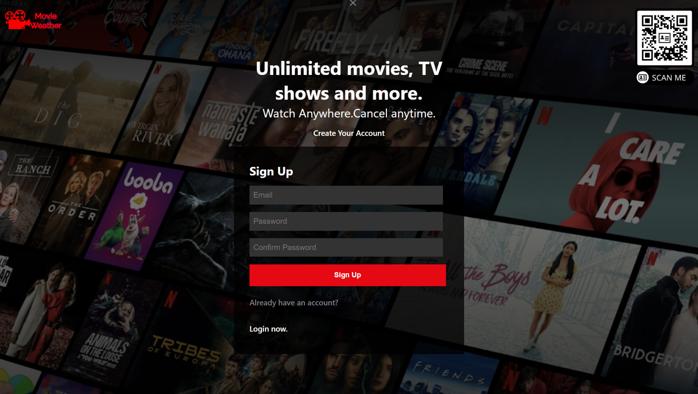
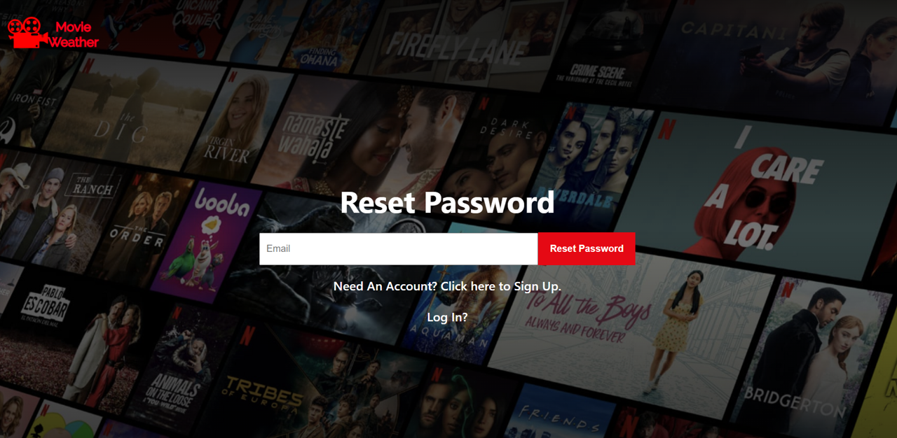
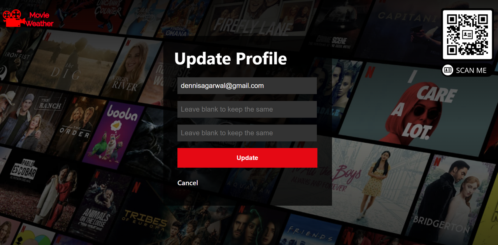
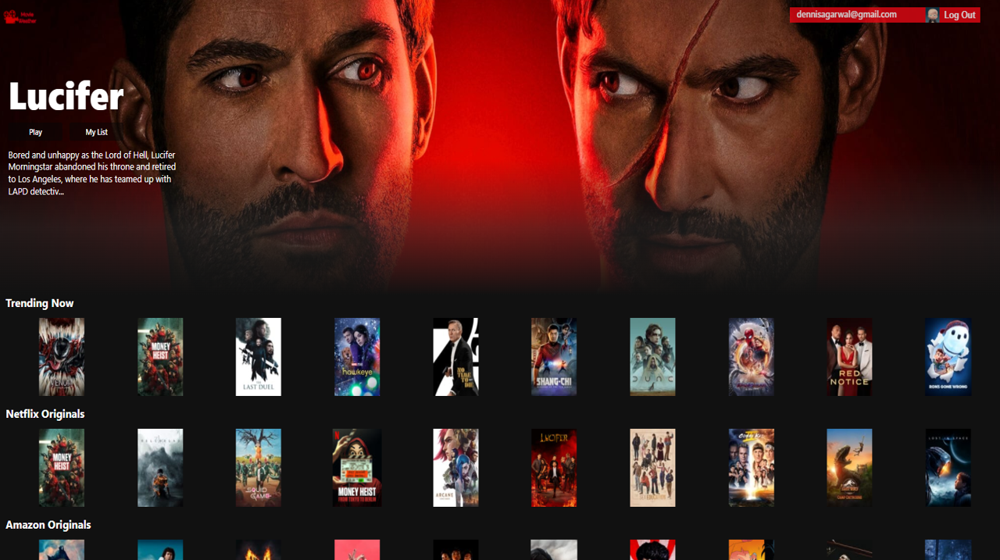
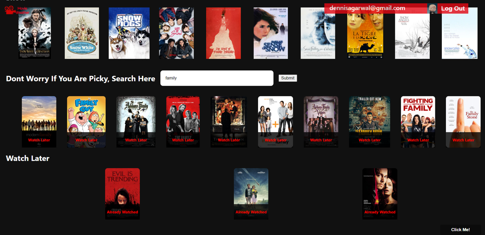

## Key Learnings

- Fully understood and implemented React fundamentals, react hook.
- Utilized React-Router for declarative routing.
- Implemented the basics of Node.js and Express, APIs.
- Used Semantic HTML, BEM methodoloy.
- Flexbox, SAAS.
- Axios

## Installation

### Clone

- Clone this repo to your local machine using `https://github.com/dennisagarwal/movie-weather-app.git`

### Setup

 **1.** Navigate to the client folder in your terminal and install npm like this:

```
$ npm install
```
### Launch application

```
$ npm start
```

#### Website Glimpse

 **1.** Login Page
 
 
 
  **2.** SignUp Page
 
 
 
  **3.** Reset Password Page
 
 
 
  **4.** Update Password Page
 
 
 
  **5.** Home Page
 
 
 
  **6.** Search Page
 
 
 
 ##### Website Link
 
 https://movie-weather-app.web.app/
